# [Aplikasi Pelaporan Pengaduan Masyarakat Berbasis Web]

## Screenshot

- ### User

  - Register

    

  - Login
  
    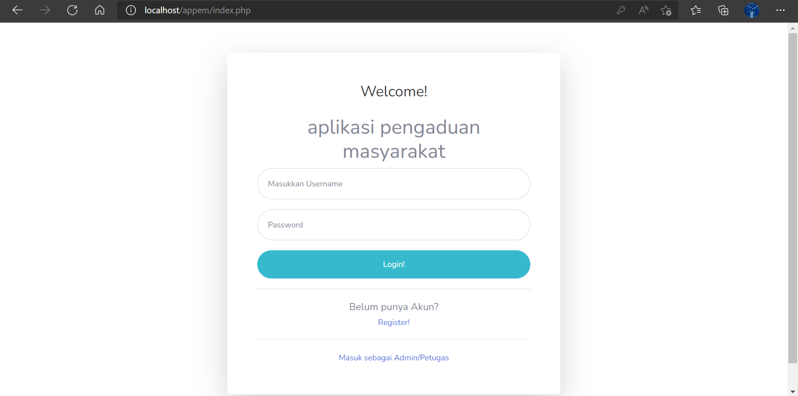
    
  - Dashboard
  
    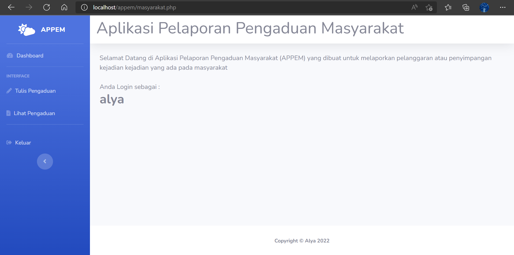

  - Tulis Pengaduan
  
    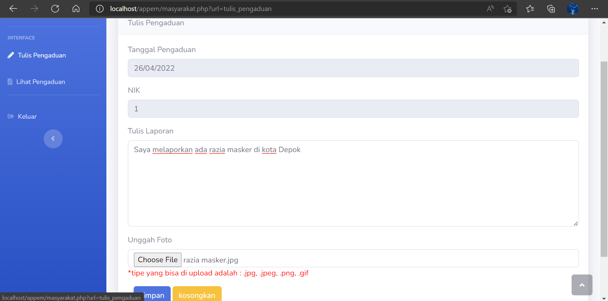
    
  - Lihat Pengaduan
  
    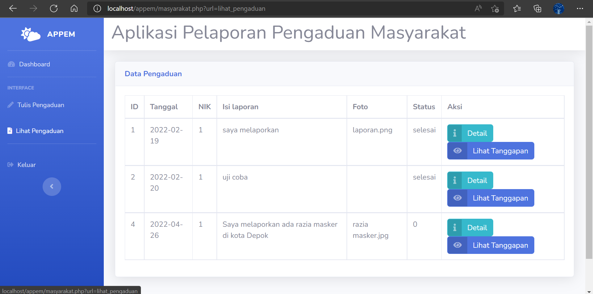
    
- ### Petugas

  - Login
  
    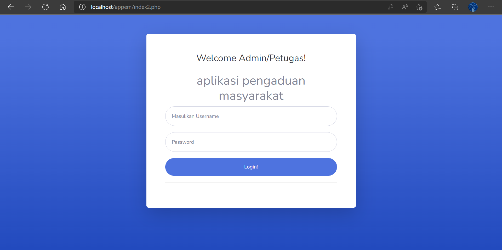
    
  - Dashboard
  
    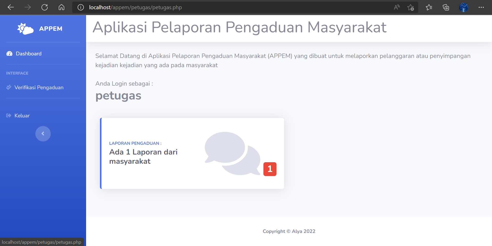
    
  - Verifikasi Pengaduan
  
    
    
  - Detail & Verifikasi
  
    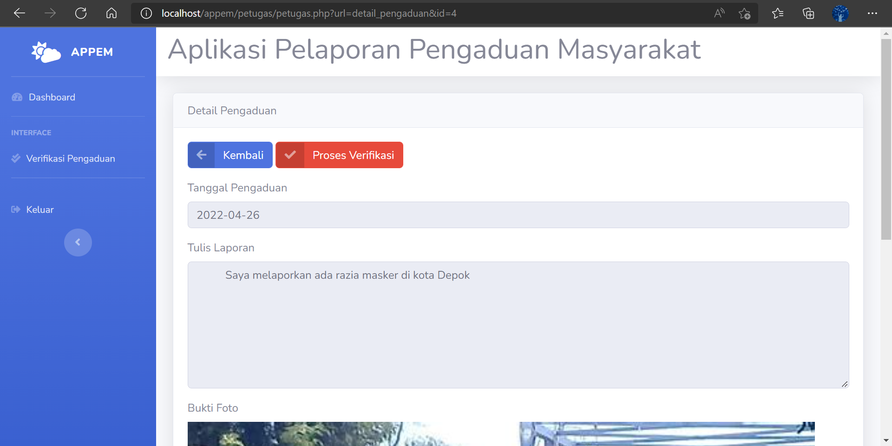
    
-  ### Admin

  - Login
  
    
    
  - Dashboard
  
    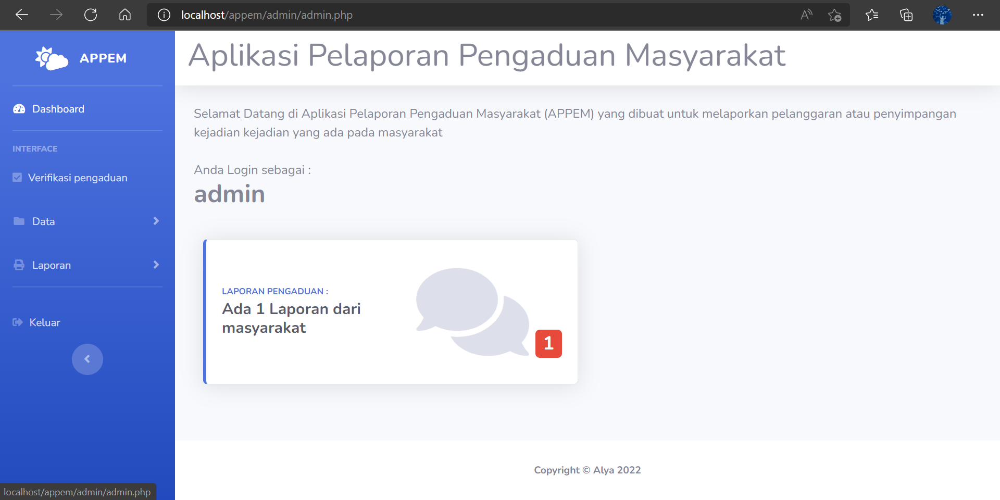
    
  - Verifikasi Pengaduan
  
    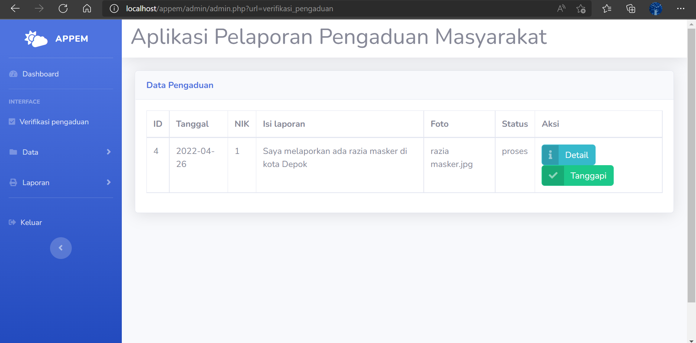
    
  - Tulis Tanggapan
  
    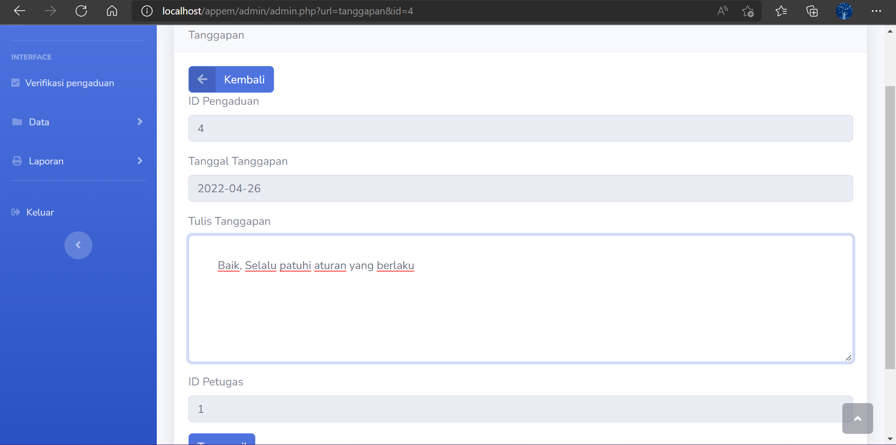
    
  - Data Tanggapan
  
    
    
  - Print Laporan Tanggapan
  
    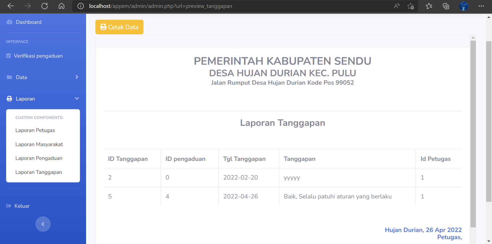
    
## Copyright and License

Copyright 2013-2019 Blackrock Digital LLC. Code released under the [MIT](https://github.com/BlackrockDigital/startbootstrap-resume/blob/gh-pages/LICENSE) license.
